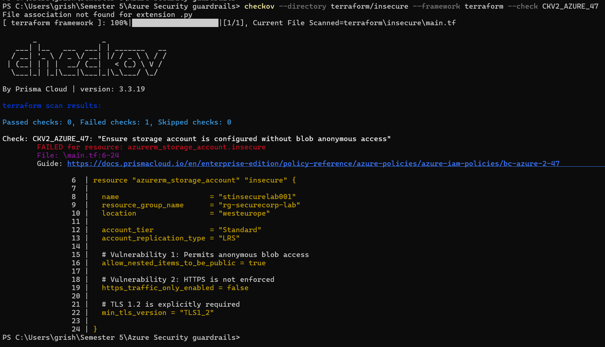
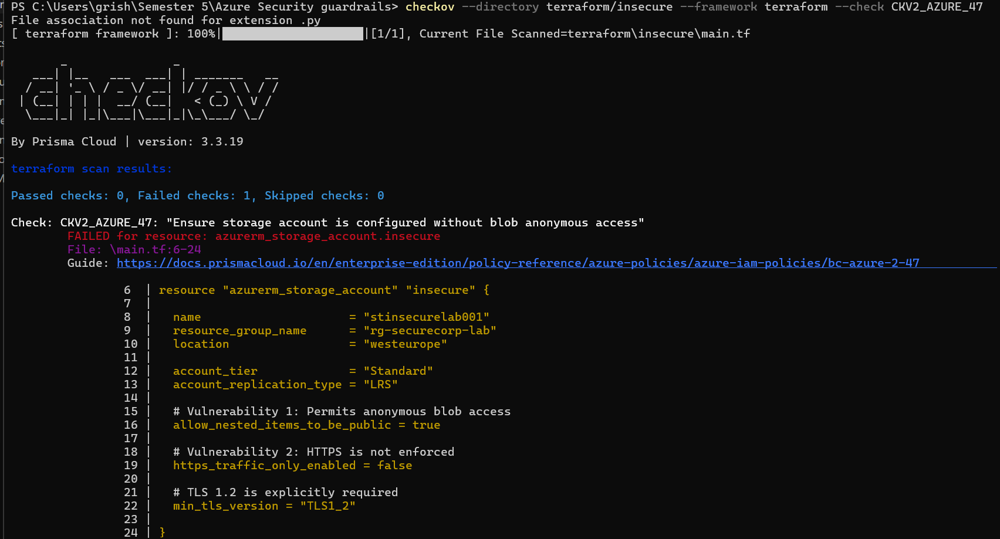
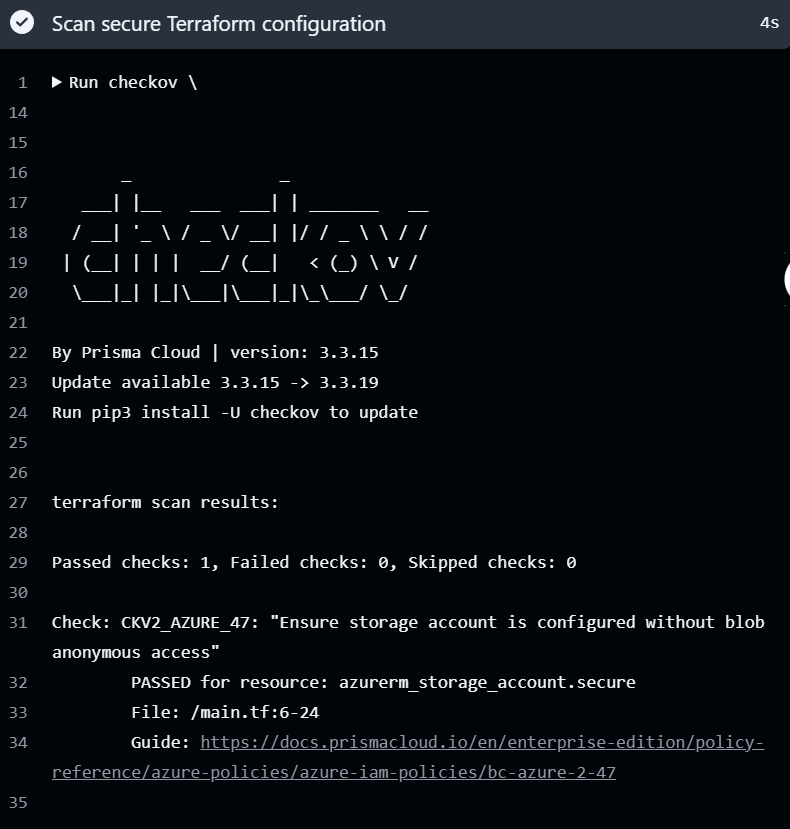

# Azure Cloud Security Guardrails

A hands-on project exploring how security misconfigurations
can be detected before cloud infrastructure is deployed.

**Tools:** Terraform · Checkov · GitHub Actions · Python

## Why I Built This

As a cybersecurity student interested in cloud security,
I wanted to understand how organizations can identify
security risks before deploying infrastructure.

Cloud misconfigurations can introduce security risks,
especially when access controls and network settings
are not configured correctly.

I built this project to explore how infrastructure-as-code
security scanning can help identify these problems during
development.

Rather than deploying resources to Azure, I created a
local lab using Terraform configuration files and used
Checkov to evaluate their security settings.

## What I Built

I created two versions of an Azure Storage account
configuration:

- An intentionally insecure version containing security
  misconfigurations.
- A corrected version with more restrictive security
  settings.

I then used Checkov to scan both configurations and
compare the results.

Finally, I integrated Checkov into GitHub Actions so
the selected security check runs automatically when
code is pushed to the main branch or a pull request
targets main.

## Security Controls

The project focuses on three storage security settings:

| Control | Insecure Configuration | Secure Configuration |
|---|---|---|
| Anonymous blob access | Permitted | Disabled |
| HTTPS-only traffic | Disabled | Enabled |
| Minimum TLS version | TLS 1.2 | TLS 1.2 |

The intentionally insecure configuration demonstrates
anonymous-access and HTTPS enforcement risks.

The TLS setting is included as an explicitly configured
security requirement.

## Security Assessment

### Test 1: Insecure Configuration

I first scanned the intentionally insecure Terraform
configuration using Checkov policy CKV2_AZURE_47.

**Result: FAILED**

- Passed checks: 0
- Failed checks: 1

Checkov identified that the storage account configuration
permits anonymous blob access.

### Test 2: Corrected Configuration

I changed the storage account configuration to explicitly
disable anonymous blob access.

I then ran the same security check again.

**Result: PASSED**

- Passed checks: 1
- Failed checks: 0

The corrected configuration successfully passed the
selected Checkov policy.

### Broader Security Scan

I also ran Checkov against the corrected configuration
without restricting the scan to a single policy.

The results were:

| Result | Checks |
|---|---:|
| Passed | 7 |
| Failed | 8 |
| Skipped | 0 |

The additional findings relate to controls such as
network access restrictions, private endpoints,
Shared Key authorization, data protection,
logging, and encryption requirements.

These findings require further investigation.
Some controls depend on the intended environment
and organizational security requirements.

The corrected configuration passes the initial
anonymous-access check but is not a fully hardened
production deployment.

[View the full JSON scan results](reports/results_json.json)

## Automated Security Scanning

To avoid relying only on manual checks, I added a
GitHub Actions workflow that runs Checkov automatically.

The current pipeline checks the corrected Terraform
configuration against policy CKV2_AZURE_47.

The initial workflow run completed successfully.

[View the successful workflow run](https://github.com/Grishmbasnet515/azure-cloud-security-guardrails/actions/runs/35512493766)

## How to Run the Security Tests

Install Checkov:

    python -m pip install checkov==3.3.19

Scan the intentionally insecure configuration:

    checkov -d terraform/insecure --framework terraform --check CKV2_AZURE_47

Scan the corrected configuration:

    checkov -d terraform/secure --framework terraform --check CKV2_AZURE_47

Run a broader assessment:

    checkov -d terraform/secure --framework terraform

## What I Learned

This project helped me understand how a small
configuration change can affect cloud security.

It also gave me practical experience with:

- Reading and analyzing Terraform configurations.
- Using security scanning tools to identify risks.
- Comparing insecure and corrected configurations.
- Interpreting security findings.
- Integrating security checks into a CI/CD workflow.

One important takeaway was that passing one security
check does not mean the entire infrastructure is secure.
The broader scan identified additional controls that
still need to be reviewed.

## Project Scope and Limitations

This is a local infrastructure-as-code security lab.

No Azure resources were deployed, and no live cloud
environment was assessed.

The current GitHub Actions workflow enforces one
specific Checkov policy. It does not block every
possible cloud misconfiguration.

## Next Steps

- Investigate and document the remaining findings.
- Improve storage access and data protection controls.
- Expand the automated security checks.
- Add a detailed security assessment report.